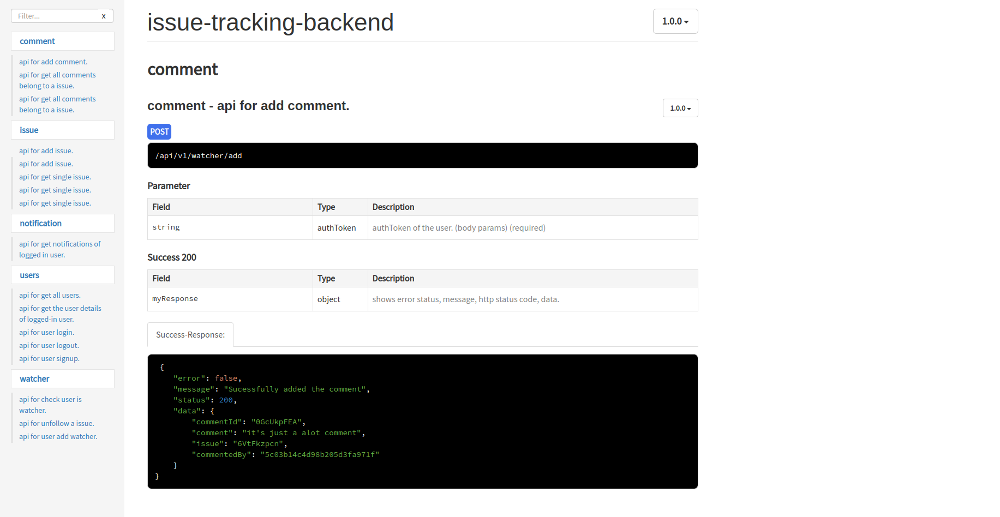

# Problem statement
[Issue tracking problem](https://github.com/ojhakash/issue-tracking-backend/blob/master/problem-solution/Web030103-Issue-Tracking-Tool.pdf)

## Run the project
- git clone https://github.com/ojhakash/issue-tracking-backend
 - docker-compose build
 - docker-compose up

Your app will be running on http://localhost:4050/

To see the api-documentation please open - http://localhost:5000/

